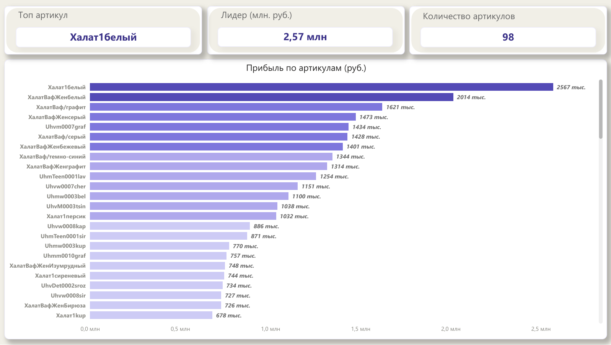
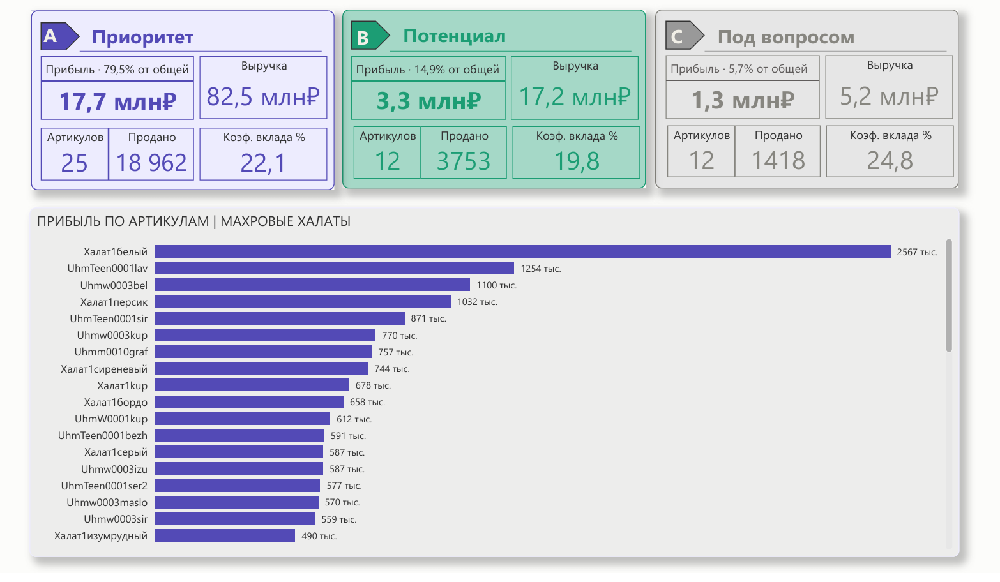

# Halat Analytics — Textile Assortment Sales Analysis

> **Stack:** MySQL · Power BI
> **Data:** 98 SKUs · 2 categories · sales period

---

## Repository Structure

```
halat-analytics/
│
├── task_1_contribution_margin/         # Task 1 — SKU ranking by profit
│   ├── contribution_margin.csv         # Calculated profit per SKU
│   ├── contribution_margin_dashboard.pbix  # Power BI source file
│   └── contribution_margin_dashboard.pdf   # Dashboard export (PDF)
│
├── task_2_abc_analysis/                # Task 2 — ABC analysis: terry robes
│   ├── ABC.csv                         # ABC classification result
│   ├── ABC_dashboard.pbix              # Power BI source file
│   └── ABC_dashboard.pdf              # Dashboard export (PDF)
│
├── data/                               # Source data
│   ├── sales_clean.csv                 # Cleaned sales data
│   ├── cost_price_clean.csv            # Cleaned cost price data
│   └── Task.xlsx                       # Original test assignment file
│
├── sql/                                # SQL queries
│   └── code.sql                        # All queries: import, cleaning, analytics
│
├── ABC_dashboard_preview.png           # Task 2 dashboard screenshot
├── CM_dashboard_preview.png            # Task 1 dashboard screenshot
└── README.md                           # Project documentation
```

---

## Task 1 — SKU Ranking by Contribution Margin

### Objective
Rank all SKUs by contribution margin for the period.
Formula: `Profit = Revenue - Cost - Logistics (15%) - Commission (34%)`

### Results
- Analyzed **98 SKUs**
- Identified **TOP-14** SKUs with profit over 1M RUB
- Absolute leader — **Khalat1bely**: revenue 13.5M RUB, profit 2.57M RUB

### Dashboard


---

## Task 2 — ABC Analysis: Terry Robes Category

### Objective
Conduct ABC analysis by contribution margin, draw conclusions and provide recommendations.

### Methodology
| Group | Cumulative profit share | Description |
|-------|------------------------|-------------|
| A | 0 — 80% | Priority SKUs |
| B | 80 — 95% | Growth potential |
| C | 95 — 100% | Under review |

### Results

| Group | SKUs | Units sold | Revenue | Profit | Margin % |
|-------|------|------------|---------|--------|----------|
| **A** — Priority | 25 | 18 962 | 82.5M RUB | 17.7M RUB | 22.1% |
| **B** — Potential | 12 | 3 753 | 17.2M RUB | 3.3M RUB | 19.8% |
| **C** — Under review | 12 | 1 418 | 5.2M RUB | 1.3M RUB | 24.8% |

### Conclusions
- **25 Group A SKUs** generate **79.5% of total profit** — require priority stock control and safety stock
- **Group C** has margin of **24.8%** — higher than Group A (22.1%) and B (19.8%). SKUs are unit-efficient but do not scale due to low demand
- **Group B** is in a growth zone — 30–40% volume increase could move SKUs into Group A

### Recommendations

**Group A:**
- Maintain safety stock for minimum 2 weeks of sales to avoid out-of-stock
- Consider 2–5% price increase on TOP-3 SKUs due to high demand

**Group B:**
- Analyze customer reviews
- Test additional promotion on 2–3 highest-margin SKUs
- Target: move to Group A through volume growth

**Group C:**
- For SKUs with no negative reviews — test price reduction to 18–20% margin level to stimulate demand
- For persistently low-demand SKUs — consider discontinuation

### Dashboard


---

## Technical Details

**Data processing (MySQL):**
- Raw CSV import with type casting
- JOIN of sales and cost tables by `sku + size`
- Window functions for cumulative share calculation (`SUM OVER ORDER BY`)
- CTEs for step-by-step analytics pipeline

**Visualization (Power BI):**
- Conditional formatting by ABC group
- DAX measures for KPI cards per group
- Gradient bar coloring by profit level

---
---

# Halat Analytics — Анализ продаж текстильного ассортимента

> **Стек:** MySQL · Power BI
> **Данные:** 98 артикулов · 2 категории · период продаж

---

## Структура репозитория

```
halat-analytics/
│
├── task_1_contribution_margin/             # Задание 1 — ранжирование артикулов по прибыли
│   ├── contribution_margin.csv             # Рассчитанная прибыль по каждому артикулу
│   ├── contribution_margin_dashboard.pbix  # Исходный файл Power BI
│   └── contribution_margin_dashboard.pdf   # Экспорт дашборда (PDF)
│
├── task_2_abc_analysis/                    # Задание 2 — ABC анализ: махровые халаты
│   ├── ABC.csv                             # Результат ABC классификации
│   ├── ABC_dashboard.pbix                  # Исходный файл Power BI
│   └── ABC_dashboard.pdf                   # Экспорт дашборда (PDF)
│
├── data/                                   # Исходные данные
│   ├── sales_clean.csv                     # Очищенные данные о продажах
│   ├── cost_price_clean.csv                # Очищенные данные о себестоимости
│   └── Task.xlsx                           # Исходный файл тестового задания
│
├── sql/                                    # SQL запросы
│   └── code.sql                            # Все запросы: импорт, очистка, аналитика
│
├── ABC_dashboard_preview.png               # Скриншот дашборда задания 2
├── CM_dashboard_preview.png                # Скриншот дашборда задания 1
└── README.md                               # Документация проекта
```

---

## Задание 1 — Ранжирование артикулов по прибыли

### Задача
Указать артикулы по убыванию маржинальной прибыли за период.
Формула: `Прибыль = Выручка - Себестоимость - Логистика (15%) - Комиссия (34%)`

### Результат
- Проанализировано **98 артикулов**
- Выявлено **ТОП-14** артикулов с прибылью свыше 1 млн руб.
- Абсолютный лидер — **Халат1белый**: выручка 13,5 млн руб., прибыль 2,57 млн руб.

### Дашборд


---

## Задание 2 — ABC анализ по категории "Махровые халаты"

### Задача
Провести ABC анализ по маржинальной прибыли, сделать выводы и дать рекомендации.

### Методология
| Группа | Накопленная доля прибыли | Характеристика |
|--------|--------------------------|----------------|
| A | 0 — 80% | Приоритетные артикулы |
| B | 80 — 95% | Артикулы с потенциалом |
| C | 95 — 100% | Артикулы под вопросом |

### Результаты

| Группа | Артикулов | Продано (шт.) | Выручка | Прибыль | Маржинальность |
|--------|-----------|---------------|---------|---------|----------------|
| **A** — Приоритет | 25 | 18 962 | 82,5 млн руб. | 17,7 млн руб. | 22,1% |
| **B** — Потенциал | 12 | 3 753 | 17,2 млн руб. | 3,3 млн руб. | 19,8% |
| **C** — Под вопросом | 12 | 1 418 | 5,2 млн руб. | 1,3 млн руб. | 24,8% |

### Выводы
- **25 артикулов группы A** генерируют **79,5% всей прибыли** категории — требуют приоритетного контроля складских остатков и страхового запаса
- **Группа C** имеет маржинальность **24,8%** — выше чем группа A (22,1%) и B (19,8%). Артикулы эффективны на единицу товара, но не масштабируются из-за низкого спроса
- **Группа B** находится в зоне роста — при увеличении объёма продаж на 30–40% артикулы могут перейти в группу A

### Рекомендации

**Группа A:**
- Обеспечить страховой запас минимум на 2 недели продаж во избежание out-of-stock
- Рассмотреть повышение цены на ТОП-3 артикула на 2–5% ввиду высокого спроса

**Группа B:**
- Провести анализ отзывов покупателей
- Протестировать дополнительное продвижение на 2–3 артикула с наибольшей маржинальностью
- Цель — перевод в группу A за счёт роста объёма

**Группа C:**
- Для артикулов без негативных отзывов — протестировать снижение цены до маржинальности 18–20% для стимулирования спроса
- Для артикулов с устойчиво низким спросом — рассмотреть вывод из ассортимента

### Дашборд


---

## Технические детали

**Обработка данных (MySQL):**
- Импорт сырых CSV с приведением типов
- JOIN таблиц продаж и себестоимости по `sku + size`
- Оконные функции для расчёта накопленной доли (`SUM OVER ORDER BY`)
- CTE для пошагового построения аналитики

**Визуализация (Power BI):**
- Условное форматирование по группам ABC
- DAX меры для KPI карточек по каждой группе
- Градиентная окраска полос по уровню прибыли
